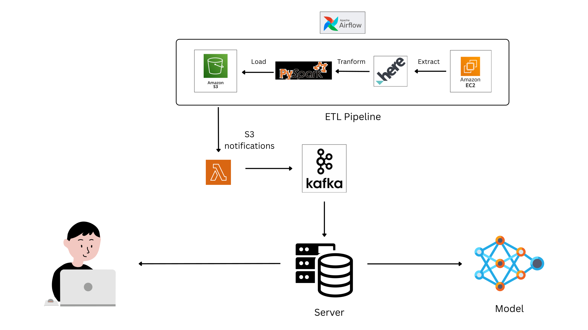

# Traffic Predictor

An applications to help you avoid traffic jams in Viet Nam

## A reliable prediction for your trip

Including the state-of-the-art model with transformer architecture in time series prediction, this is a reliable and modern way to help you

# TimeXer architecture


This is the model I used in this project. The TimeXer model learns both the covariation from exogenous and endogenous through Attention with a global parameter that help the model makes a better prediction

## Front end

Basic front end built with html, css, js is hosted at [Vercel](https://traffic-predictor-one.vercel.app/) inside the web folder. I used the free open source Leaflet that help me create a map and custome it. And it totally FREEE

# Back end

A Flask made back end is in the folder app. To run this back end, you will need to

```bash
cd app
pip install -r requirements.txt
```

Then

```bash
cd app
python app.py
```

Or if you are a MacOS, Linux user (like me)

```bash
cd app
pip3 install -r requirements.txt
python3 app.py
```

# Server architecture



ETL Pipeline is implemented with Airflow for data orchestrating. Firstly, extract data from an API source. The data then be processed with Pyspark for big data processing. Then loaded into S3 Bucket. When new data is added, S3 bucket notification event trigger to call to AWS Lambda. Lambda get the newest data, feed them into Kafka topic for batch streaming to server.

That's all!

# The very last speech

A simple project of my team the course Deep Learning for Data Science (DS201) and Big data (DS200) in my University (UIT-VNU)

Our reports in Vietnamese: [Report](Report.pdf)

Due to the financial burden, the server was offline now. The demo video is at [Google Drive](https://drive.google.com/file/d/1mamEGHzSNm7dcN8Vu6hDZNIEtI02sKzh/view?usp=sharing)
