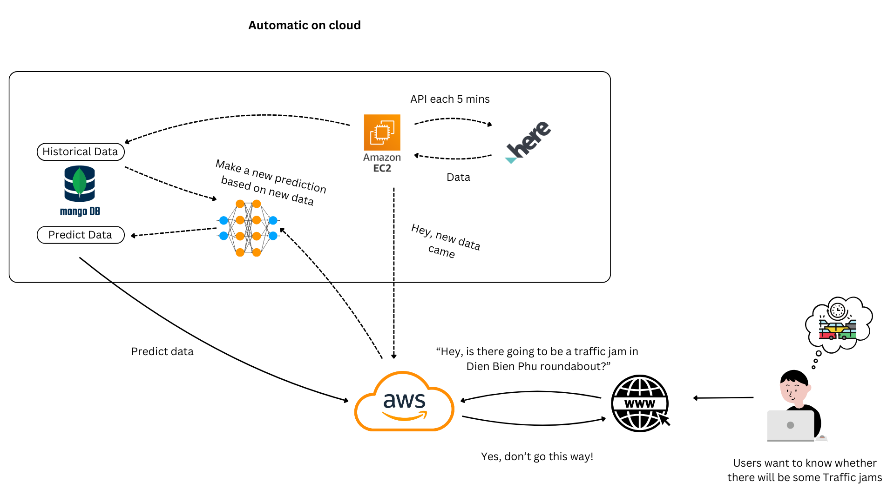

# Traffic Predictor
 
 An applications to help you avoid traffic jams in Viet Nam

 ## A reliable prediction for your trip

Including the state-of-the-art model with transformer architecture in time series prediction, this is a reliable and modern way to help you

# TimeXer architecture


This is the model I used in this project. The TimeXer model learns both the covariation from exogenous and endogenous through Attention with a global parameter that help the model makes a better prediction 

## Front end
Basic front end built with html, css, js is hosted at [Vercel](https://traffic-predictor-one.vercel.app/) inside the web folder. I used the free open source Leaflet that help me create a map and custome it. And it totally FREEE

# Back end
A Flask made back end is in the folder app. To run this back end, you will need to 

```bash
cd app
pip install -r requirements.txt
```

Then

```bash
cd app
python app.py
```

Or if you are a MacOS, Linux user (like me) 

```bash
cd app
pip3 install -r requirements.txt
python3 app.py
```

But this backend have a .env contain password to my mongodb, maybe you need to create your own database traffic if you wanna run your own app :joy:

# Server architecture


I have another VM run on ec2 to calling HERE api every 5 mins to get the current traffic to collect them into my mongodb. Because traffic services don't give me historical data so I have to do this :joy:

After called the API and got data, this VM make a request to the server like 'Hey, come and make prediction, you got new data'. And the server makes predictions base on state-of-the-art transformer-based model in time series prediction (TimeXer) and store in database.

Each time users wanna know will there be a traffic jam, the server just has to get the data in the prediction section in database to reduce waiting time of users.

There are 8 locations in Ho Chi Minh City I used to get data, maybe you wanna have a look in ```/web/assets/locations.json```. Unfortunately, Thu Duc Crossway location makes the API confuse so it can not fetch Thu Duc Cross Way correctly

That's all! 

# The very last speech

A simple project of my team the course Deep Learning for Data Science (DS201) in my University (UIT-VNU)

Due to the financial burden, the server was offline now. The demo video is at 
