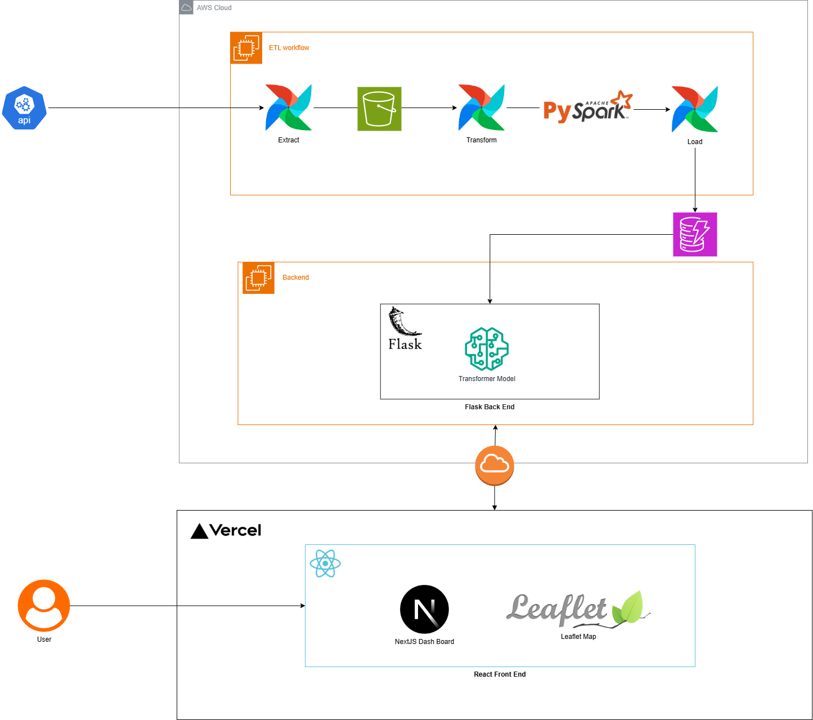
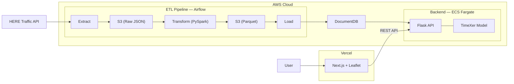

<p align="center">
  
</p>

<h1 align="center">Traffic Predictor</h1>

<p align="center">
  Real-time traffic monitoring and transformer-based speed forecasting for Ho Chi Minh City.
</p>

<p align="center">
  
  
  
  
  
  
  
</p>

---

## Overview

TrafficPredictor is an end-to-end data engineering and machine learning system that ingests live traffic flow data from the [HERE Traffic API](https://developer.here.com/documentation/traffic-api/dev_guide/topics/what-is.html), processes it through an ETL pipeline, and serves speed forecasts via a **TimeXer** transformer model.

| Component | Stack | Deployment |
|-----------|-------|------------|
| **Frontend** | Next.js 15, Tailwind CSS 4, Leaflet | Vercel |
| **Backend** | Flask 3, PyTorch, Pydantic v2 | AWS ECS Fargate |
| **ETL Pipeline** | Apache Airflow 2.10, PySpark, boto3 | AWS MWAA |
| **Database** | MongoDB / Amazon DocumentDB | AWS DocumentDB |
| **Infrastructure** | Terraform (modular) | AWS |

## Architecture


```mermaid
flowchart LR
  subgraph aws [AWS Cloud]
    subgraph etl [ETL Pipeline — Airflow]
      Extract --> S3Raw["S3 (Raw JSON)"]
      S3Raw --> Transform["Transform (PySpark)"]
      Transform --> S3Clean["S3 (Parquet)"]
      S3Clean --> Load
    end
    subgraph backend [Backend — ECS Fargate]
      Flask["Flask API"]
      TimeXer["TimeXer Model"]
      Flask --- TimeXer
    end
    DocDB["DocumentDB"]
    Load --> DocDB
    DocDB --> Flask
  end

  HERE["HERE Traffic API"] --> Extract
  User --> Frontend
  subgraph vercel [Vercel]
    Frontend["Next.js + Leaflet"]
  end
  Frontend -->|"REST API"| Flask
```

## Repository Structure

```
TrafficPredictor/
├── backend/          # Flask REST API + TimeXer inference
├── web/              # Next.js dashboard with Leaflet map
├── airflow/          # Airflow DAGs + custom operators for ETL
├── infra/            # Terraform modules (VPC, ECS, MWAA, DocumentDB, S3)
├── docs/             # Architecture docs + API reference
├── docker-compose.yml
└── .github/workflows/ci.yml
```

Each component has its own README with detailed setup instructions:

- [`backend/README.md`](backend/README.md) — Flask API setup, endpoints, Docker
- [`frontend/README.md`](frontend/README.md) — Next.js local dev, Vercel deployment
- [`airflow/README.md`](airflow/README.md) — DAG documentation, Airflow Variables
- [`infra/README.md`](infra/README.md) — Terraform modules, deployment steps

## Quick Start

### Prerequisites

- Docker & Docker Compose
- Node.js 20+ (for the web dashboard)

### 1. Start Backend + Airflow (Docker)

```bash
# Start all services (backend, Airflow, MongoDB, Postgres, Redis)
docker compose up -d

# Backend API:       http://localhost:5000
# Airflow UI:        http://localhost:8080  (airflow / airflow)
```

### 2. Start Frontend (local)

```bash
cd web
cp .env.example .env.local
npm install
npm run dev

# Dashboard:         http://localhost:3000
```

### 3. Deploy Infrastructure (Terraform)

```bash
cd infra
terraform init
terraform plan -var-file=environments/dev.tfvars -var="docdb_master_password=<password>"
terraform apply -var-file=environments/dev.tfvars -var="docdb_master_password=<password>"
```

## Data Pipeline

The ETL pipeline runs every 5 minutes and follows these stages:

| Stage | Task | Description |
|-------|------|-------------|
| 1 | **Extract** | Fetch real-time traffic flow from HERE API |
| 2 | **Upload** | Store raw JSON snapshot in S3 |
| 3 | **Transform** | PySpark: parse flow data, compute speed (km/h), write Parquet |
| 4 | **Load** | Upsert transformed records into DocumentDB |
| 5 | **Predict** | Trigger TimeXer inference via backend API |

## ML Model — TimeXer

The forecasting engine is a **TimeXer** (Time-series Exogenous Transformer) model that takes 96 time-steps of multi-variate traffic speed data and predicts the next 12 steps (60 minutes at 5-minute intervals).

| Parameter | Value |
|-----------|-------|
| Sequence length | 96 |
| Prediction horizon | 12 |
| Variates | 325 (8 real + padding) |
| Patch length | 12 |
| d_model | 256 |
| Encoder layers | 4 |
| Preprocessing | DWT denoising (db4 wavelet) |

## API Reference

See [`docs/api-reference.md`](docs/api-reference.md) for full documentation.

| Method | Endpoint | Description |
|--------|----------|-------------|
| `GET` | `/health` | Health check |
| `POST` | `/api/current` | Current speed for a coordinate |
| `POST` | `/api/predict` | Speed forecast for a coordinate |
| `POST` | `/api/db_notice` | Trigger batch prediction update |

## License

This project is for portfolio and educational purposes.
