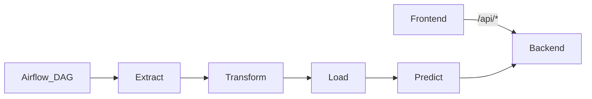

# TrafficPredictor (Portfolio Refactor)

This repository is a **portfolio-style refactor** of the original TrafficPredictor project: clean monorepo layout, modern frontend, layered backend, and an Airflow ETL orchestration design.

The goal is to be **beautiful + “production-shaped”** (readable, maintainable, well-structured). It does not need to be fully runnable end-to-end.

## Repository layout

- **Backend**: `backend/` (Flask API with routes/services/repositories)
- **Frontend**: `frontend/` (React + Vite; map UI + dashboard)
- **ETL Orchestration**: `airflow/` (Airflow DAGs; cloud-ready structure)
- **Legacy reference**: `frontend/public/legacy-web/` and `airflow/legacy-etl/`

## Architecture overview

```mermaid
flowchart LR
  FE[Frontend] -->|"/api/*"| BE[Backend]
  AF[Airflow_DAG] --> EXT[Extract]
  EXT --> TR[Transform]
  TR --> LD[Load]
  LD --> PR[Predict]
  PR --> BE
```

## Backend (Flask)

- Entry module: `backend/app/app.py`
- API base path: `/api`
  - `POST /api/current`
  - `POST /api/predict`
  - `POST /api/db_notice`
- Health check: `GET /health`

## Frontend (React)

- App lives in `frontend/`
- Config via env:
  - Copy `frontend/.env.example` → `frontend/.env`
  - Set `VITE_API_URL=http://localhost:5000`

## Airflow (ETL)

- DAGs live in `airflow/dags/`
- Main demo DAG: `airflow/dags/traffic_etl_dag.py`

## Assets / report

- Report: `Report.pdf`
- Images: `image/`
