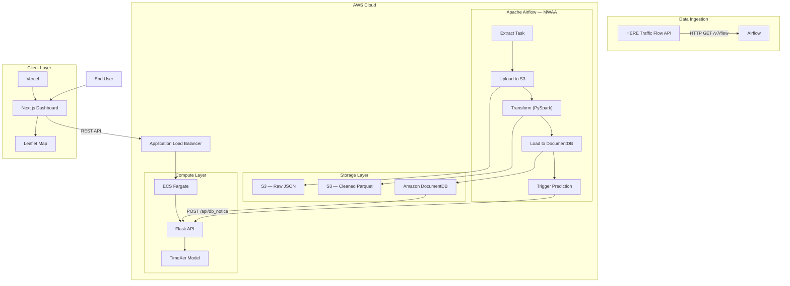
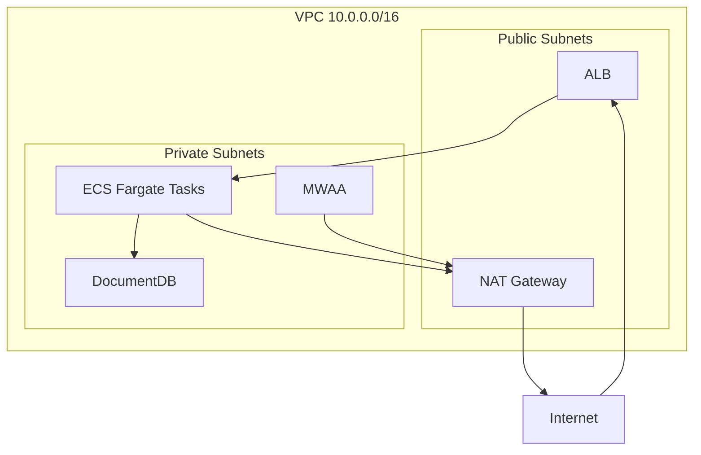

# Architecture

This document describes the system architecture, data flow, and component responsibilities of the TrafficPredictor platform.

## System Overview

TrafficPredictor is a three-tier system designed for real-time traffic monitoring and forecasting in Ho Chi Minh City:

1. **Data Ingestion & ETL** — Apache Airflow orchestrates a pipeline that extracts traffic data from the HERE Traffic API, transforms it with PySpark, and loads it into DocumentDB.
2. **Backend API** — A Flask application serves traffic data and runs inference using a TimeXer transformer model.
3. **Frontend Dashboard** — A Next.js application with an interactive Leaflet map, deployed on Vercel.

## Architecture Diagram




## Component Details

### ETL Pipeline (Airflow)

The pipeline runs on a 5-minute schedule:

| Step | Input | Processing | Output |
|------|-------|-----------|--------|
| Extract | HERE API | HTTP request with circle query around HCMC | Raw JSON |
| Upload | Raw JSON | Write to S3 with timestamp key | `s3://bucket/raw/traffic/{ts}.json` |
| Transform | Raw JSON from S3 | PySpark: parse flow data, filter road segments, convert speed m/s to km/h, add metadata | `s3://bucket/transformed/traffic/{ts}/` (Parquet) |
| Load | Parquet from S3 | Read with Spark, insert records into DocumentDB collections | DocumentDB `Traffic` database |
| Predict | — | POST to backend `/api/db_notice` | Predictions in `Predictions` collection |

### Backend (Flask)

The backend follows a layered architecture:

```
Routes → Services → Repositories → MongoDB/DocumentDB
                  → Models (TimeXer)
```

- **Routes** handle HTTP request/response, validation via Pydantic schemas.
- **Services** contain business logic (speed conversion, prediction orchestration).
- **Repositories** abstract database access (MongoRepository).
- **Models** encapsulate the TimeXer neural network and inference logic.

#### Prediction Flow

1. Backend receives a trigger via `/api/db_notice`.
2. `PredictionService` fetches the last 96 speed readings per location from MongoDB.
3. Data is preprocessed: DWT denoising (db4 wavelet) and zero-padding to 325 variates.
4. TimeXer model runs inference, producing 12-step forecasts.
5. Predictions are written back to the `Predictions` collection.

### Frontend (Next.js)

- **Server-side rendering** for the page shell (layout, metadata).
- **Client-side** interactive map (Leaflet loaded via `next/dynamic` to skip SSR).
- **Sidebar** with location search, selection, and forecast display.
- Communicates with backend via `NEXT_PUBLIC_API_URL` environment variable.

### Infrastructure (Terraform)

All AWS resources are provisioned via Terraform modules:

| Module | Resources |
|--------|-----------|
| `networking` | VPC, 2+ AZs, public/private subnets, NAT gateway, route tables |
| `ecr` | ECR repositories for backend and Airflow images |
| `ecs` | Fargate cluster, task definition, service, ALB with health checks |
| `mwaa` | Managed Airflow environment with S3 DAG source |
| `documentdb` | DocumentDB cluster with single instance |
| `s3` | Data bucket (versioned, encrypted) + DAG bucket for MWAA |

## Network Topology



## Monitoring Locations

The system monitors 8 traffic points across Ho Chi Minh City:

| Location | Coordinates |
|----------|-------------|
| Cau Sai Gon (Saigon Bridge) | 10.7989, 106.7270 |
| Cau Rach Chiec | 10.8132, 106.7568 |
| Cau Dien Bien Phu | 10.7934, 106.7004 |
| Dai Hoc Bach Khoa (BKU) | 10.7721, 106.6576 |
| Cong Vien Hoang Van Thu | 10.8018, 106.6649 |
| Vong Xoay Dan Chu | 10.7779, 106.6813 |
| Cong Vien Le Thi Rieng | 10.7855, 106.6633 |
| Duong Truong Chinh | 10.8168, 106.6320 |
