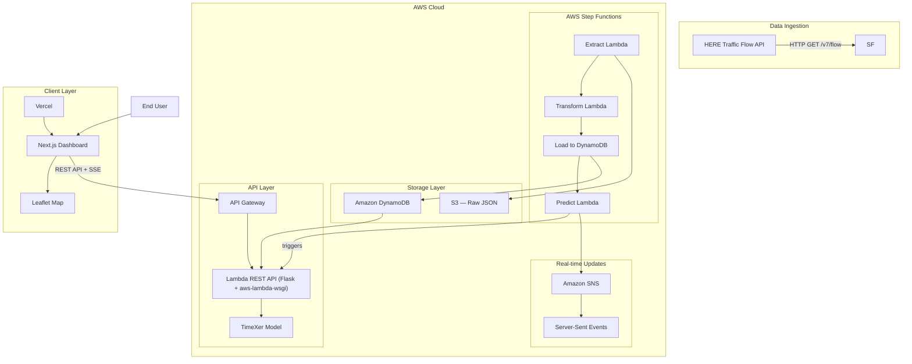
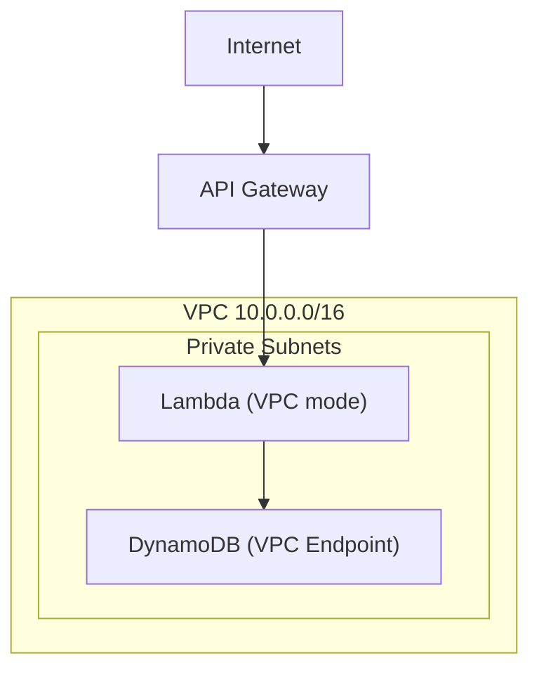

# Architecture

This document describes the system architecture, data flow, and component responsibilities of the TrafficPredictor platform.

## System Overview

TrafficPredictor is a serverless three-tier system designed for real-time traffic monitoring and forecasting in Ho Chi Minh City:

1. **Data Ingestion & ETL** — AWS Step Functions orchestrate a pipeline of Lambda functions that extract traffic data from the HERE Traffic API, transform it, and load it into DynamoDB.
2. **Backend API** — A Flask application (wrapped as a Lambda handler via `aws-lambda-wsgi`) serves traffic data and runs inference using a TimeXer transformer model.
3. **Frontend Dashboard** — A Next.js application with an interactive Leaflet map, deployed on Vercel, consuming real-time updates via Server-Sent Events.

## Architecture Diagram

```
┌──────────────────────────────────────────────────────────────┐
│                        AWS Cloud                              │
│                                                               │
│  HERE API → Step Function (Extract → Transform → Load → Predict)
│              ↕                                                │
│  DynamoDB ← API Gateway → Lambda REST API                     │
│              ↕                                                │
│  WebSocket/SNS → Browser (SSE)                                │
│                                                               │
└──────────────────────────────────────────────────────────────┘
                            ↑
┌──────────────────────────────────────────────────────────────┐
│                     Frontend (Vercel)                         │
│  Next.js 15 + Tailwind CSS + Leaflet Map + SSE client        │
└──────────────────────────────────────────────────────────────┘
```


```mermaid
flowchart TB
  subgraph ingestion [Data Ingestion]
    HERE["HERE Traffic Flow API"]
    HERE -->|"HTTP GET /v7/flow"| SF
  end

  subgraph aws [AWS Cloud]
    subgraph stepfunction [AWS Step Functions]
      Extract["Extract Lambda"]
      Transform["Transform Lambda"]
      Load["Load to DynamoDB"]
      Predict["Predict Lambda"]
      Extract --> Transform --> Load --> Predict
    end

    subgraph storage [Storage Layer]
      DynDB["Amazon DynamoDB"]
      S3["S3 — Raw JSON"]
    end

    Extract --> S3
    Load --> DynDB

    subgraph api [API Layer]
      APIGW["API Gateway"]
      Lambda["Lambda REST API (Flask + aws-lambda-wsgi)"]
      TimeXer["TimeXer Model"]
      APIGW --> Lambda
      Lambda --> TimeXer
    end

    DynDB --> Lambda
    Predict -->|triggers| Lambda

    subgraph realtime [Real-time Updates]
      SNS["Amazon SNS"]
      SSE["Server-Sent Events"]
    end

    Predict --> SNS --> SSE
  end

  subgraph client [Client Layer]
    Vercel["Vercel"]
    NextJS["Next.js Dashboard"]
    Leaflet["Leaflet Map"]
    Vercel --> NextJS
    NextJS --> Leaflet
  end

  NextJS -->|"REST API + SSE"| APIGW
  User["End User"] --> NextJS
```

## Component Details

### ETL Pipeline (Step Functions)

The pipeline runs on a 5-minute schedule, orchestrated by AWS Step Functions:

| Step | Component | Input | Processing | Output |
|------|-----------|-------|-----------|--------|
| Extract | Lambda | HERE API | HTTP request with circle query around HCMC | Raw JSON → S3 |
| Transform | Lambda | Raw JSON from S3 | Parse flow data, filter road segments, convert speed m/s to km/h, add metadata | Structured records |
| Load | Lambda | Transformed records | Batch upsert into DynamoDB | DynamoDB table |
| Predict | Lambda | Latest 96 readings | DWT denoising → TimeXer inference → store forecasts | Predictions in DynamoDB |

### Backend (Flask + Lambda)

The backend is a Flask application wrapped in an `aws-lambda-wsgi` handler for Lambda + API Gateway. It follows a layered architecture:

```
API Gateway → Lambda (aws-lambda-wsgi) → Flask → Services → Repositories → DynamoDB
                                                    → Models (TimeXer)
```

- **Routes** handle HTTP request/response, validation via Pydantic schemas.
- **Services** contain business logic (speed conversion, prediction orchestration).
- **Repositories** abstract database access (DynamoDB via boto3 + MongoRepository for local dev).
- **Models** encapsulate the TimeXer neural network and inference logic.

#### Prediction Flow

1. Step Functions triggers the Predict Lambda after new data is loaded.
2. Predict Lambda fetches the last 96 speed readings per location from DynamoDB.
3. Data is preprocessed: DWT denoising (db4 wavelet) and zero-padding to 325 variates.
4. TimeXer model runs inference, producing 12-step forecasts.
5. Predictions are written back to DynamoDB.
6. An SNS notification triggers SSE updates to connected browser clients.

### Frontend (Next.js)

- **Server-side rendering** for the page shell (layout, metadata).
- **Client-side** interactive map (Leaflet loaded via `next/dynamic` to skip SSR).
- **Sidebar** with location search, selection, and forecast display.
- **SSE client** (`EventSource`) receives real-time updates from the backend.
- Communicates with backend via `NEXT_PUBLIC_API_URL` environment variable.

### Infrastructure (Terraform)

All AWS resources are provisioned via Terraform modules:

| Module | Resources |
|--------|-----------|
| `networking` | VPC, 2+ AZs, public/private subnets, NAT gateway, route tables |
| `lambda` | Lambda functions for API + ETL + predictions |
| `api_gateway` | REST API with resource paths, methods, and Lambda integration |
| `step_functions` | State machine for ETL pipeline |
| `dynamodb` | DynamoDB tables for traffic data, segments, predictions |
| `sns` | Notification topics for real-time updates |
| `s3` | Data bucket (versioned, encrypted) |

## Network Topology


```mermaid
flowchart TB
  subgraph vpc [VPC 10.0.0.0/16]
    subgraph private [Private Subnets]
      Lambda["Lambda (VPC mode)"]
      DynDB["DynamoDB (VPC Endpoint)"]
    end
    Lambda --> DynDB
  end
  Internet --> APIGW["API Gateway"]
  APIGW --> Lambda
```

## Monitoring Locations

The system monitors 8 traffic points across Ho Chi Minh City:

| Location | Coordinates |
|----------|-------------|
| Cau Sai Gon (Saigon Bridge) | 10.7989, 106.7270 |
| Cau Rach Chiec | 10.8132, 106.7568 |
| Cau Dien Bien Phu | 10.7934, 106.7004 |
| Dai Hoc Bach Khoa (BKU) | 10.7721, 106.6576 |
| Cong Vien Hoang Van Thu | 10.8018, 106.6649 |
| Vong Xoay Dan Chu | 10.7779, 106.6813 |
| Cong Vien Le Thi Rieng | 10.7855, 106.6633 |
| Duong Truong Chinh | 10.8168, 106.6320 |
